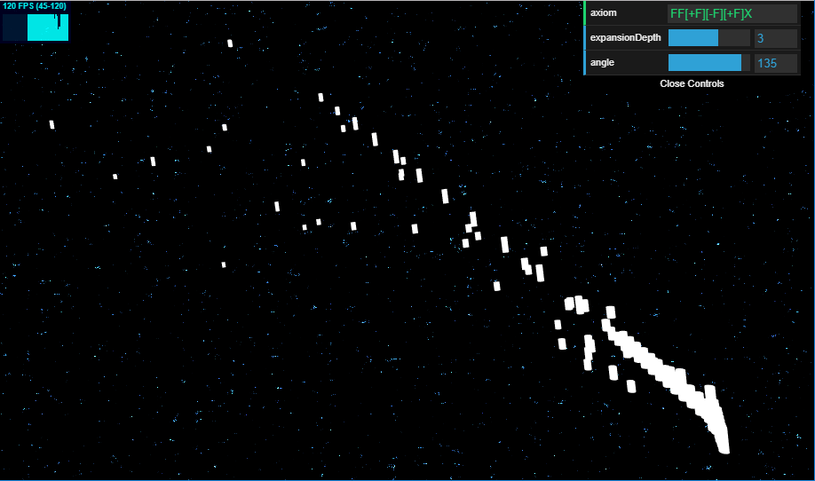
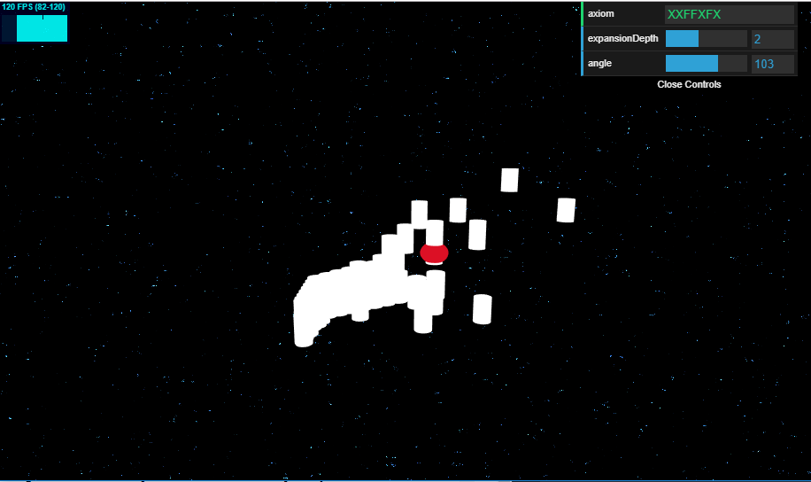

# Homework 4: Luckily Lost in Space...
Jake Snipes

PennKey: jsnipes

## Images

An L-System with no visible ornamentations

A system with one visible ornamentation; I had a lot of trouble getting these to show frequently.

## Techniques
### Grammar
The grammar is constructed in a probabilistic manner, expanded based on a random number that is generated as the axiom string is parsed. Only the F and + characters cause expansion, while all others are constant. I had a good deal of trouble getting the grammar to look good (as can be seen in my screenshots), so I would like to work more on tweaking my expansion rules in the future. Once the axiom was expanded, the new string was iterated over again and the appropriate draw functions were called. My system clearly has a problem with handling rotations about a mesh's local center that I couldn't figure out despite my best efforts.

### Geometry
The branch geometry (cylinders) and ornamentation geometry (spheres) are loaded as OBJ files and rendered using instanced rendering. That is, the mesh is rendered multiple times in a single draw call, with each instance being given its own properties (e.g. - position, orientation, scale, color, etc.).

### Background
The background uses a technique similar to that in my Environment Setpiece to create a starry background from FBM noise.

### Mesh Shading
Clearly, the meshes appear flat shaded. I attempted to write a Lambertian shader with three-point lighting for the instanced geometry but could not get it to work -- I expect this was due to nuances with instanced rendering that would require me to instance some other variables. 

## GUI Inputs
The modifiable GUI inputs are as follows:
- Axiom: Write any axiom you want to change the L-System! Valid characters are 'F', 'X', '+', '-', '[', and ']'. Any other characters will be ignored.
- ExpansionDepth: This represents the number of times the axiom will be recursively expanded. Make it higher for a more complex system!
- Angle: The maximum angle at which branches will separate.

## Live Demo
https://jacobsnipes.com/hw04-l-systems

## Resources Used
I used no resources outside of my previous code from this class, TAs, and documentation.
